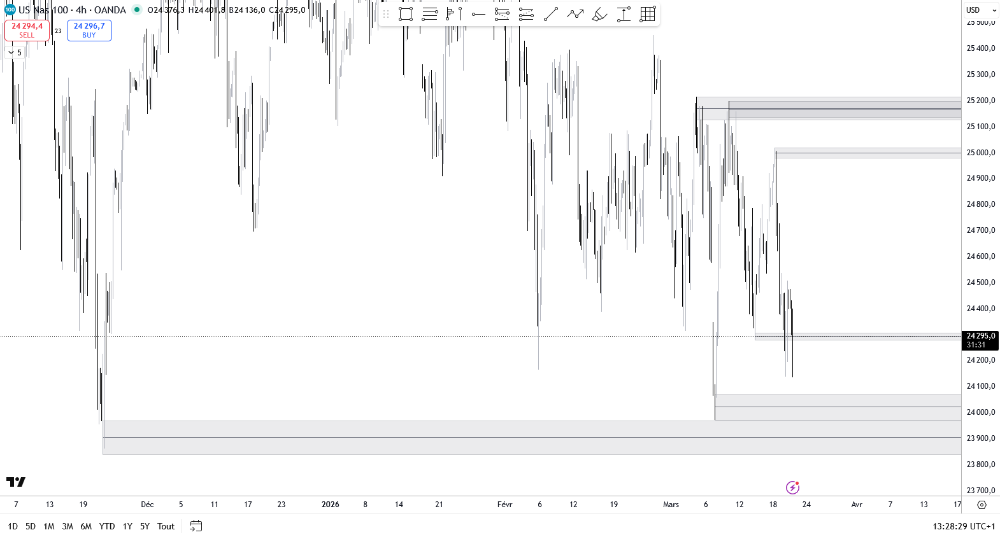

# JCO HTF Swing Zones

A TradingView Pine Script v6 indicator that draws supply and demand zones based on Higher Time Frame (HTF) swing highs and lows.

## Description

Each zone represents the **wick area** of an HTF pivot candle — the range between the candle body and the wick tip. This is the area where price was rejected, making it a relevant supply (high) or demand (low) zone.

The indicator scans backwards from the current bar to find the **N closest unviolated zones** above and below current price, ensuring the most relevant levels are always displayed regardless of how far back in history they formed.

## How It Works

- **Swing detection**: Uses `ta.pivothigh` / `ta.pivotlow` on the selected HTF with a configurable pivot length (number of bars required on each side to confirm a pivot)
- **Zone boundaries**: Top = wick tip, Bottom = candle body edge (max/min of open & close of the pivot candle)
- **Backward scan**: Starting from the most recent bar, scans backwards through HTF pivot history
  - High zones: each new zone must have its **wick tip strictly above** the wick tip of the previous one
  - Low zones: each new zone must have its **wick tip strictly below** the wick tip of the previous one
  - Zones are ordered from closest to furthest wick from price; body overlap between adjacent zones is allowed and expected — it signals high-impact price areas touched by multiple pivot wicks
- **Mitigation filter**: A pivot zone is skipped if any more recent **closed** HTF candle has closed beyond its wick tip (close > wick for highs, close < wick for lows) — only untested zones are displayed; the current (forming) HTF bar is excluded from this check
- **Zone fusion**: Overlapping zones are automatically merged into one (maximum extent, anchored at the oldest pivot); the zone counter decrements only once per merged group
- **Midline**: Optional horizontal line at the center of each zone

## Parameters

### Configuration

| Parameter | Default | Description |
|-----------|---------|-------------|
| Timeframe HTF | 240 (H4) | Higher timeframe used for swing detection |
| Nb zones High | 3 | Number of resistance zones to display above price |
| Nb zones Low | 3 | Number of support zones to display below price |
| Longueur pivot | 5 | Number of bars required on each side to confirm a pivot |

### Appearance

| Parameter | Default | Description |
|-----------|---------|-------------|
| Couleur zone | Gray 85% | Zone fill color |
| Bordure | Gray 70% | Zone border color |
| Afficher le milieu | true | Show midline at center of each zone |
| Couleur milieu | Gray | Midline color |
| Epaisseur milieu | 1 | Midline width (1–4) |

## Notes

- All calculations use **HTF bar space**: one sample is recorded per closed HTF bar, making results identical regardless of the chart timeframe
- The scan runs on the last bar only (`barstate.islast`) and always reflects the current market state
- HTF history covers the last 2000 closed HTF bars (~2.7 years of H4 data at 6.5 h/day)
- If fewer than N qualifying pivots exist within the lookback window, fewer zones will be displayed

## Changelog

### v1.5 — 2026-03-23

- Zone fusion: overlapping zones are automatically merged into one (maximum extent, anchored at the oldest pivot); the zone counter decrements only once per merged group
- HTF history buffer increased from 500 to 2000 bars (~2.7 years of H4 data), fixing missing zones on instruments with deep history

### v1.4 — 2026-03-23

- All calculations now use HTF bar space (one sample per closed HTF bar), eliminating timeframe-dependent behaviour (e.g. zones missing on 15-minute charts)
- The current forming HTF bar is excluded from the mitigation check — only closed candles count
- The chart timeframe is only used to anchor the start of drawn rectangles

### v1.3 — 2026-03-23

- Added mitigation filter: a pivot zone is skipped if any more recent HTF candle has closed beyond its wick tip (close > wick for highs, close < wick for lows) — only untested zones are displayed

### v1.2 — 2026-03-21

- Removed unused merge/fusion parameter and functions (dead code cleanup)

### v1.1 — 2026-03-20

- Fixed zone positioning: switched to `xloc.bar_time` to correctly anchor boxes at the pivot candle regardless of market session gaps
- Fixed zone selection: ladder condition now compares wick tip to wick tip (`z_top > last_h_top`) instead of body to wick, so spike candles with small bodies are no longer rejected

### v1.0 — 2026-03-20

- Initial release

## License

[Mozilla Public License 2.0](https://mozilla.org/MPL/2.0/)

© jcornier
